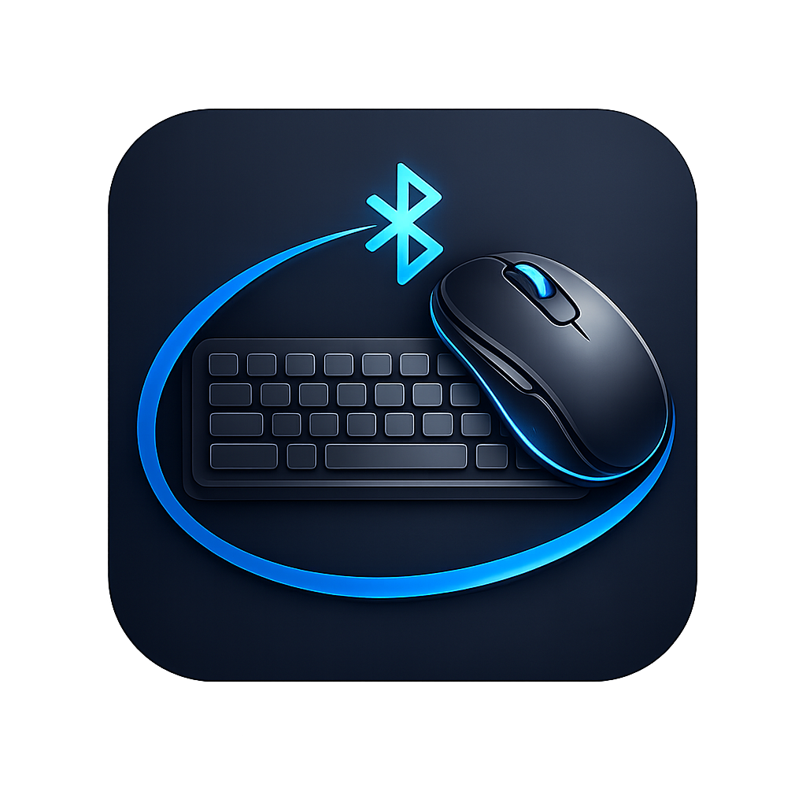

  
   
  <h1>🖱️ CKPad</h1>
  
Turn your phone into a wireless <strong>touchpad, gyro mouse, and keyboard</strong> for your PC, Mac, or Linux.

  

---

## What is CKPad?

CKPad connects your phone to your computer over Bluetooth — no dongles, no drivers, nothing to install on your PC. Once paired, your phone becomes a real input device:

- 🖱️ **Touchpad** — move the cursor, click, scroll, and switch desktops
- 🌀 **Gyro mouse** — aim your phone like a laser pointer to control the cursor
- ⌨️ **Keyboard** — type and fire shortcuts straight into your computer
- 🔤 **QWERTY / AZERTY / QWERTZ** layouts, remembered per device

---

## 📖 HOW TO USE

### Step 1 — Pair Your Phone with Your PC (first time only)

1. Open **CKPad** on your phone and turn on Bluetooth.
2. Wait until the status reads `HID SERVICE ONLINE`.
3. Tap **Pair New PC**.
4. On your computer, open **Bluetooth settings** → **Add device** → select your phone.
5. Back in CKPad, tap your PC under **PAIRED HOSTS** to connect.
6. Done — you're in control.

> Your last connected PC is remembered, so next time you just open the app and tap it once.

---

### Step 2 — Touchpad Mode

This is the default tab. The bottom half of the screen is your touch surface.

| Gesture | Action |
| --- | --- |
| 🖱️ Drag with 1 finger | Move cursor |
| 👆 Tap 1 finger | Left click |
| 👆👆 Double tap | Double click |
| 🖐️ Scroll with 2 fingers | Scroll up/down or left/right |
| ✊ Hold with 2 fingers | Right click |
| ⬅️➡️ Swipe 2 fingers left/right | Switch desktop / Mission Control |

Use the **Left / Right buttons** at the bottom for click and right-click.

---

### Step 3 — Gyro Mode

Hold the phone like a laser pointer and aim at the screen.

- 🎯 **Tilt the phone** to move the cursor.
- 👆 **Double-tap** the screen to recenter the cursor.
- 🔊 **Hold Volume Up** to scroll — tilt to scroll up/down.
- 🔊 **Tap Volume Down** to click.
- 🔄 If the cursor drifts, tap **Recalibrate Sensors** and hold the phone still.

---

### Step 4 — Keyboard & Shortcuts

- ⌨️ Tap the keyboard button to slide up the on-screen keyboard and start typing.
- ⚡ Use the **shortcut pills** (e.g. `Ctrl+C`, `Cmd+V`, `Alt+Tab`) to fire full key combos in one tap.
- 🔤 Use the **layout picker** to switch between **QWERTY / AZERTY / QWERTZ**. Each PC remembers its own layout.

---

### Step 5 — Settings

Adjust **cursor sensitivity**, **scroll speed**, **button swapping**, and your **operating system** (macOS / Windows / Linux) from the gear icon in each mode.

---

### Step 6 — Disconnecting

- Tap the red **power button** in the top corner to disconnect.
- If the connection drops, just tap anywhere on the screen to go back.
